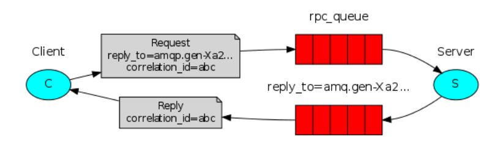

# Sentiment Model

## Table of Contents
- [What this webpage does](#introduction)
- [Major elements of this repo](#major-elements)
- [How it works](#how-it-works)
- [How to install](#installation)
- [How to run](#run)
- [Footer](#footer)

## What this webpage does <a name="introduction"></a>
This app is a simple sentiment analyzer created with the help of tensorflow. It takes in user input and then predicts if the sentiment is positive or negative.

## Major Elements of this repo <a name="major-elements"></a>
- The `requirements.txt` are the basic python libraries required to use the project.
- The `app.py` is a Flask Webpage. This takes care of getting the data from the form and working as a RabbitMQ Producer.
- The `templates` folder holdes the `home.html` webpage that has the form and displays the result.
- The `worker.py` is a RabbitMQ worker that recieves the message from the Producer (app.py), makes a prediction and sends a reply back to the Producer. <br/><br/>

**Please Note: ModelCreation directory contains the code for building the model, however it is not required to run our project as we have stored the model seperately**

## How it works <a name="how-it-works"></a>
 <br/>
*(Taken from: https://www.rabbitmq.com/)* <br/>
When the user enters the text and clicks on the Submit button, input message is passed on to the Worker via a Remote Procedure Call. The worker then uses the Sentiment Model to predict the sentiment of the message. Then it sends a reply back to the Producer for it to display the result on the webpage.   

## How to install (Windows) <a name="installation"></a>
*(Note: I am asssuming you have Python, Pip, Git and RabbitMQ installed on your machine)* <br/>
```
git clone https://github.com/karans-15/final-task-gfactors
```

## How to run (Windows) <a name="run"></a>
Install all dependencies first
```
pip install -r requirements.txt
```
Run the worker in one terminal
```
python worker.py
```
Run the flask app from another terminal
```
python app.py
```
Your app is setup!! Now you should be able to open your browser at http://localhost:5000 and use the app.

## Footer <a name="footer"></a>
Feel free to leave a star in GitHub if you found this helpful :)
